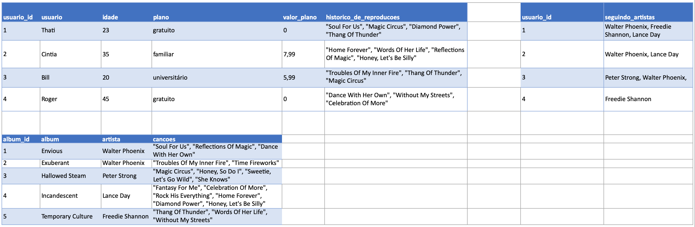
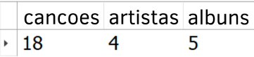
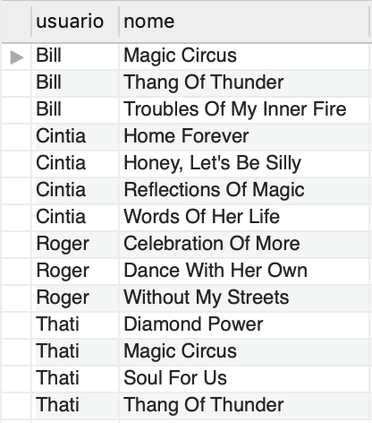
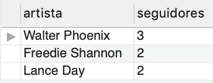
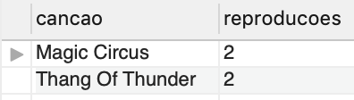
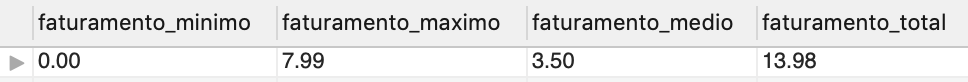
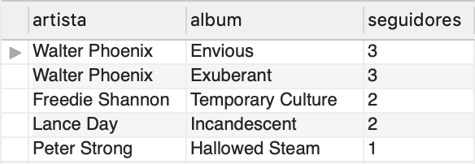
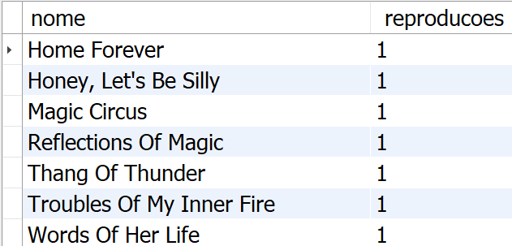

### Termos e acordos

Ao iniciar este projeto, você concorda com as diretrizes do Código de Ética e Conduta e do Manual da Pessoa Estudante da Trybe.

---

# Boas vindas ao repositório do projeto One For All!

Você já usa o GitHub diariamente para desenvolver os exercícios, certo? Agora, para desenvolver os projetos, você deverá seguir as instruções a seguir. Fique atento a cada passo e, se tiver qualquer dúvida, nos envie por Slack! #vqv 🚀

Aqui você vai encontrar os detalhes de como estruturar o desenvolvimento do seu projeto a partir desse repositório, utilizando uma branch específica e um Pull Request para colocar seus códigos.

---

# SUMÁRIO

- [Habilidades](#habilidades)
- [Entregáveis](#entregáveis)
  - [O que deverá ser desenvolvido](#o-que-deverá-ser-desenvolvido)
  - [Desenvolvimento](#desenvolvimento)
  - [Data de entrega](#data-de-entrega)
- [Instruções para entregar seu projeto](#instruções-para-entregar-seu-projeto)
  - [Antes de começar a desenvolver](#antes-de-começar-a-desenvolver)
  - [Durante o desenvolvimento](#durante-o-desenvolvimento)
- [Como desenvolver](#como-desenvolver)
  - [Problema a ser resolvido](#problema-a-ser-resolvido)
  - [Implmentações técnicas](#implementações-técnicas)
- [Requisitos do projeto](#requisitos-do-projeto)
  - [Desafio 1](#desafio-1)
  - [Desafio 2](#desafio-2)
  - [Desafio 3](#desafio-3)
  - [Desafio 4](#desafio-4)
  - [Desafio 5](#desafio-5)
  - [Desafio 6](#desafio-6)
  - [Desafio 7](#desafio-7)
  - [Desafio 8](#desafio-8)
  - [Desafio 9](#desafio-9)
  - [Desafio 10](#desafio-10)
  - [Desafio 11](#desafio-11)
- [Depois de terminar o desenvolvimento](#depois-de-terminar-o-desenvolvimento)
- [Revisando um pull request](#revisando-um-pull-request)
- [Avisos Finais](#avisos-finais)

---

# Habilidades
Neste projeto, verificamos se voce é capaz de:

  * Modelar um banco de dados

  * Identificar entidades , atributos e relacionamentos
  
  * Aplicar a 1ª, 2ª e 3ª Forma Normal

  * Criar tabelas
  
  * Lidar com VIEWs

  * Alterar tabelas existentes

  * Criar reações dinâmicas com TRIGGERS

---

# Entregáveis

Para entregar o seu projeto você deverá criar um Pull Request neste repositório.

Lembre-se que você pode consultar nosso conteúdo sobre
[Git & GitHub](https://course.betrybe.com/intro/git/) sempre que precisar!

---

## O que deverá ser desenvolvido

Hoje, no projeto ***One For All***, você usará **uma** tabela para revisar e consolidar **todos** os principais conceitos vistos até o momento.

Você receberá uma tabela não normalizada, a qual deverá ser normalizada e populada, para que você possa executar queries sobre ela com o intuito de encontrar as informações solicitadas.

## Desenvolvimento

Normalize uma tabela na terceira forma normal e acesse as informações desta tabela através de `queries` utilizando `SQL`.

## Data de Entrega

  - Serão `X` dias de projeto.
  - Data de entrega para avaliação final do projeto: `DD/MM/YYYY - 14:00h`.

---

## Instruções para entregar seu projeto:

### Antes de começar a desenvolver

1. Clone o repositório
  * `git clone https://github.com/tryber/sd-012-mysql-one-for-all.git`.
  * Entre na pasta do repositório que você acabou de clonar:
    * `cd sd-012-mysql-one-for-all`

2. Instale as dependências
  * `npm install`

3. Crie uma branch a partir da branch `master`
  * Verifique que você está na branch `master`
    * Exemplo: `git branch`
  * Se não estiver, mude para a branch `master`
    * Exemplo: `git checkout master`
  * Agora, crie uma branch onde você vai guardar os `commits` do seu projeto
    * Você deve criar uma branch no seguinte formato: `nome-de-usuario-nome-do-projeto`
    * Exemplo: `git checkout -b seunome-mysql-one-for-all`

4. Para cada exercício você deve criar um novo arquivo sql seguindo a seguinte estrutura:
  * desafio1.sql, desafio2.sql, desafio3.sql, desafio4.sql, ..., desafioN.sql

5. Adicione as mudanças ao _stage_ do Git e faça um `commit`
  * Verifique que as mudanças ainda não estão no _stage_
    * Exemplo: `git status` (deve aparecer o arquivo que você alterou como desafio1.sql)
  * Adicione o novo arquivo ao _stage_ do Git
      * Exemplo:
        * `git add .` (adicionando solução para desafio 1)
        * `git status` (deve aparecer listado o arquivo _desafio1.sql_ em verde)
  * Faça o `commit` inicial
      * Exemplo:
        * `git commit -m 'iniciando o projeto MySQL One For All'` (fazendo o primeiro commit)
        * `git status` (deve aparecer uma mensagem tipo _nothing to commit_ )


## Durante o desenvolvimento

* Faça `commits` das alterações que você fizer no código regularmente

* Lembre-se de sempre após um (ou alguns) `commits` atualizar o repositório remoto

* Os comandos que você utilizará com mais frequência são:
  1. `git status` _(para verificar o que está em vermelho - fora do stage - e o que está em verde - no stage)_
  2. `git add` _(para adicionar arquivos ao stage do Git)_
  3. `git commit` _(para criar um commit com os arquivos que estão no stage do Git)_
  4. `git push -u origin nome-da-branch` _(para enviar o commit para o repositório remoto na primeira vez que fizer o `push` de uma nova branch)_
  5. `git push` _(para enviar o commit para o repositório remoto após o passo anterior)_

---

# Como desenvolver

Para cada desafio, crie um arquivo SQL e inclua sua solução nele.

1. Leia a pergunta e crie um arquivo **na pasta raiz do projeto** chamado `desafioN.sql`, em que N é o número do desafio (exemplo: desafio3.sql). Para o [primeiro desafio](#desafio-1), é preciso criar também o arquivo de configurações `desafio1.json` *também na pasta raiz do projeto*.

2. O arquivo deve conter apenas o código SQL do desafio resolvido. **Não se esqueça de incluir o ponto e vírgula (";")** no final de suas queries e também de **colocar o nome do banco_de_dados.tabela por completo**, como no exemplo a seguir:
```sql
SELECT * FROM SpotifyClone.artista;
```

**Dica:** sempre seguir esse padrão e não utilizar a linha abaixo nos arquivos `desafionN.sql`,
```sql
use SpotifyClone;
```

3. Atente-se a detalhes de digitação em seu código. Qualquer diferença em nomes, apelidos, ou CAIXA ALTA e caixa baixa podem invalidar suas respostas.

4. Faça isso até finalizar todos os desafios e depois siga as instruções de como entregar o projeto em [**Instruções para entregar seu projeto**](#instruções-para-entregar-seu-projeto)

5. Para entregar o seu projeto você deverá criar um _Pull Request_ neste repositório. Este _Pull Request_ deverá conter tanto o arquivo de configurações `desafio1.json` do [primeiro desafio](#desafio-1) quanto os arquivos `desafio1.sql`, `desafio2.sql` e assim por diante até o `desafio11.sql`, que conterão seu código `SQL` de cada desafio, respectivamente.

## ⚠️ É importante que seus arquivos tenham exatamente estes nomes! ⚠️

Qualquer dúvida, procure a monitoria. Lembre-se que você pode consultar nosso conteúdo sobre [Git & GitHub](https://course.betrybe.com/intro/git/) sempre que precisar!

---

## Problema a ser resolvido

Você receberá uma tabela não normalizada semelhante ao que poderia ser uma versão simplificada do banco de dados do Spotify. O trabalho consistirá de duas partes:

1. Normalizar essa tabela, criar o schema no seu banco de dados local e populá-lo;

2. Realizar os desafios no seu banco normalizado e populado.

**Aviso:** Todos os dados da tabela abaixo são fictícios e foram gerados aleatoriamente através de ferramentas, com o intuito de deixar o projeto mais real para vocês 😉. Quaisquer similaridades com informações reais são meras coincidências.

**Observação:** O banco de dados real do Spotify é muito mais completo e complexo que o mostrado abaixo. No entanto, use APENAS as informações passadas e solicitadas aqui. Não crie dados que não foram solicitados.

## Normalize as tabelas para a 3ª Forma Normal

Abaixo você pode visualizar e baixar uma planilha com as tabelas que deverão ser normalizadas:


[Faça o download dela aqui](./SpotifyClone-Non-NormalizedTable.xlsx)

Antes de tudo, você deverá modelar e normalizar essas tabelas para a 3° Forma Normal. Monte quantas planilhas e tabelas forem necessárias para criar essa versão normalizada, desde que você siga as regras de negócio. Não é necessário criar o código SQL neste momento.

**Embora não seja necessário, é recomendado que você crie suas planilhas na sequência 1ª -> 2ª -> 3ª Forma Normal**.

Caso haja dúvidas, consulte o material já passado até hoje para te auxiliar.

Seu banco de dados deve seguir as regras de negócio e ser capaz de recuperar:

* Informações sobre quais planos estão disponíveis e seus detalhes;
  * Cada pessoa usuária pode possuir apenas um plano.

* Informações sobre todas as pessoas artistas;
  * Uma pessoa artista pode ter vários álbuns;
  * Uma pessoa artista pode ser seguida por várias pessoas usuárias.

* Informações sobre todos os álbuns de cada artista;
  * Para fins deste projeto, considere que cada álbum possui apenas uma pessoa artista como principal;
  * Cada álbum possui várias canções.

* Informações sobre todas as canções de cada álbum;
  * Para fins deste projeto, considere que cada canção está contida em apenas um álbum.

* Informações sobre todas as pessoas usuárias, seus planos, seu histórico de reprodução e pessoas artistas seguidas.
  * Uma pessoa usuária pode possuir apenas um plano;
  * Cada música do histórico de reprodução pode aparecer uma única vez por pessoa (para simplificar, considere que o objetivo do histórico é saber **quais** canções já foram reproduzidas e **não quantas vezes** foram reproduzidas);
  * Uma pessoa usuária pode seguir várias pessoas artistas, mas cada pessoa artista pode ser seguida apenas uma vez por pessoa usuária.

---

## Implementações técnicas

Algumas coisas devem seguir um padrão pré-estabelecido para que os testes de correção funcionem adequadamente:

1. Ao modelar o banco de dados no [desafio 1](#desafio-1):

  * Quando for preciso que uma `coluna_a` referencie uma coluna `coluna_b` em outra tabela, é **necessário** que na `coluna_a` haja restrição de foreign key e que `coluna_b` seja uma primary key;

  * Quando for necessário fazer uso do relacionamento muitos para muitos (`N..N`), a tabela criada para modelar esse tipo de relacionamento **precisa** ter sua chave primária composta por suas foreign keys.

2. **Todos** os desafios que pedirem para criar uma view **devem** possuir no seu arquivo `.sql` correspondente **somente** a query para a criação da view.

3. Para executar localmente os testes, é preciso escrever o seguinte no seu terminal:
    ```sh
    MYSQL_USER=<SEU_NOME_DE_PESSOA_USUARIA> MYSQL_PASSWORD=<SUA SENHA> HOSTNAME=<NOME_DO_HOST> npm test
    ```

  * Ou seja, suponha que para poder acessar a base de dados feita neste projeto você tenha `root` como seu nome de pessoa usuária, `password` como senha e `localhost` como host. Logo, você executaria:
    ```sh
    MYSQL_USER=root MYSQL_PASSWORD=password HOSTNAME=localhost npm test
    ```

  * Usando o exemplo anterior de base, suponha que você não tenha setado uma senha para `root`. Neste caso, você executaria:
    ```sh
    MYSQL_USER=root MYSQL_PASSWORD= HOSTNAME=localhost npm test
    ```
---

# Requisitos do projeto

## Desafio 1

* Crie um banco com o nome de **`SpotifyClone`**.

* Providencie as queries necessárias para criar tabelas normalizadas que atendam aos requisitos descritos na seção anterior;

* Providencie as queries necessárias para popular as tabelas de acordo com os dados listados na seção anterior;

* Crie um arquivo de configurações `desafio1.json`, que mapeará em qual tabela e coluna se encontram as informações necessárias para a avaliação automatizada deste desafio. As configurações devem possuir o seguinte formato:

```json
{
  "coluna_usuario": "nome-da-coluna",
  "tabela_que_contem_usuario": "nome-da-tabela-que-armazena-a-coluna",
  "coluna_plano": "nome-da-coluna",
  "tabela_que_contem_plano": "nome-da-tabela-que-armazena-a-coluna",
  "coluna_historico_de_reproducoes": "nome-da-coluna",
  "tabela_que_contem_historico_de_reproducoes": "nome-da-tabela-que-armazena-a-coluna",
  "coluna_seguindo_artistas": "nome-da-coluna",
  "tabela_que_contem_seguindo_artistas": "nome-da-tabela-que-armazena-a-coluna",
  "coluna_artista": "nome-da-coluna",
  "tabela_que_contem_artista": "nome-da-tabela-que-armazena-a-coluna",
  "coluna_album": "nome-da-coluna",
  "tabela_que_contem_album": "nome-da-tabela-que-armazena-a-coluna",
  "coluna_cancoes": "nome-da-coluna",
  "tabela_que_contem_cancoes": "nome-da-tabela-que-armazena-a-coluna"
}
```

Essa configuração deve ser feita baseada no seu banco de dados **após a normalização**. Ou seja, se você criou uma tabela chamada `users` que possui a coluna `name`, você substituiria `"coluna_usuario"` e `"tabela_que_contem_usuario"` da seguinte forma:

```json
{
  "coluna_usuario": "name",
  "tabela_que_contem_usuario": "users",
  ...
}
```

* Salve as queries criadas no arquivo `desafio1.sql`. Seu código deverá ser similar ao seguinte:

```sql
DROP DATABASE IF EXISTS SpotifyClone;

CREATE DATABASE SpotifyClone;

USE SpotifyClone;

CREATE TABLE tabela1(
    coluna1 tipo restricoes,
    coluna2 tipo restricoes,
    colunaN tipo restricoes,
) engine = InnoDB;

CREATE TABLE tabela2(
    coluna1 tipo restricoes,
    coluna2 tipo restricoes,
    colunaN tipo restricoes,
) engine = InnoDB;

INSERT INTO tabela1 (coluna1, coluna2)
VALUES
  ('exemplo de dados 1', 'exemplo de dados A'),
  ('exemplo de dados 2', 'exemplo de dados B'),
  ('exemplo de dados 3', 'exemplo de dados C');

INSERT INTO tabela2 (coluna1, coluna2)
VALUES
  ('exemplo de dados 1', 'exemplo de dados X'),
  ('exemplo de dados 2', 'exemplo de dados Y');
```

O que será verificado:

- Será validado se os planos estão na tabela normalizada.

- Será validado se o histórico de reprodução está na tabela normalizada.

- Será validado se as informações sobre pessoas seguindo artistas estão na tabela normalizada.

- Será validado se os álbuns estão na tabela normalizada.

- Será validado se os canções estão na tabela normalizada.

- Será validado se as informações sobre pessoas usuárias estão na tabela normalizada.

- Será validado se as informações sobre pessoas artistas estão na tabela normalizada.

⚠️ Note que uma vez executado um teste, a sua base de dados `SpotifyClone` **será dropada**. Logo, **se atente** a salvar seu progresso nos arquivos de desafio! ⚠️

---

## Desafio 2

Crie uma `VIEW` chamada `estatisticas_musicais` que exiba três colunas:

1. A primeira coluna deve exibir a quantidade total de canções. Dê a essa coluna o alias "**cancoes**".

2. A segunda coluna deve exibir a quantidade total de artistas e deverá ter o alias "**artistas**".

3. A terceira coluna deve exibir a quantidade de álbuns e deverá ter o alias "**albuns**".

Sua `VIEW` deve retornar a seguinte informação ao ser consultada:



O que será verificado:

- Será validado se existe uma `VIEW` chamada `estatisticas_musicais` que exibe os dados corretos nas colunas **cancoes**, **artistas** e **albuns**".

---

## Desafio 3

Crie uma `VIEW` chamada `historico_reproducao_usuarios`. Essa `VIEW` deverá ter apenas duas colunas:

1. A primeira coluna deve possuir o alias "**usuario**" e exibir o nome da pessoa usuária.

2. A segunda coluna deve possuir o alias "**nome**" e exibir o nome da canção ouvida pela pessoa com base no seu histórico de reprodução.

Os resultados devem estar ordenados por nome da pessoa usuária em ordem alfabética e em caso de empate no nome os resultados devem ser ordenados pelo nome da canção em ordem alfabética.

Sua `VIEW` deve retornar a seguinte informação, ao ser consultada:



O que será verificado:

- Será validado se existe uma `VIEW` chamada `historico_reproducao_usuarios` que exibe os dados corretos nas colunas **usuario** e **nome**".

- Será validado se as colunas estão ordenadas de forma correta.

---

## Desafio 4

Crie uma `VIEW` com o nome `top_3_artistas` que deve mostrar somente as três pessoas artistas mais populares no banco `SpotifyClone`, possuindo as seguintes colunas:

1. A primeira coluna deve possuir o alias "**artista**" e exibir o nome da pessoa artista.

2. A segunda coluna deve ter o alias "**seguidores**" e exibir a quantidade de pessoas que estão seguindo aquela pessoa artista.

Seu resultado deve estar ordenado em ordem decrescente, baseando-se na quantidade de seguidores. Em caso de empate, ordene os resultados pelo nome da pessoa artista em ordem alfabética.

Sua `VIEW` deve retornar a seguinte informação, ao ser consultada:



O que será verificado:

- Será validado se existe uma `VIEW` chamada `top_3_artistas` que exibe os dados corretos nas colunas **artista** e **seguidores**".

- Será validado se as colunas estão ordenadas de forma correta.

---

## Desafio 5

Estamos fazendo um estudo das músicas mais tocadas e precisamos saber quais são as duas músicas mais tocadas no momento. Crie uma `VIEW` chamada `top_2_hits_do_momento` que possua duas colunas:

1. A primeira coluna deve possuir o alias "**cancao**" e exibir o nome da canção.

2. A segunda coluna deve possuir o alias "**reproducoes**" e exibir a quantidade de pessoas que já escutaram a canção em questão.

Seu resultado deve estar ordenado em ordem decrescente, baseando-se no número de reproduções. Em caso de empate, ordene os resultados pelo nome da canção em ordem alfabética. Queremos apenas o top 2 de músicas mais tocadas.

Sua `VIEW` deve retornar a seguinte informação, ao ser consultada:




O que será verificado:

- Será validado se existe uma `VIEW` chamada `top_2_hits_do_momento`, que exibe os dados corretos nas colunas **cancao** e **reproducoes**".

- Será validado se as colunas estão ordenadas de forma correta.

---

## Desafio 6

Tendo como base o valor dos planos e o plano que cada pessoa usuária cadastrada possui no banco, queremos algumas informações sobre o faturamento da empresa. Crie uma `VIEW` chamada `faturamento_atual` que deve exibir quatro dados:

1. A primeira coluna deve ter o alias "**faturamento_minimo**" e exibir o menor valor de plano existente para uma pessoa usuária.

2. A segunda coluna deve ter o alias "**faturamento_maximo**" e exibir o maior valor de plano existente para uma pessoa usuária.

3. A terceira coluna deve ter o alias "**faturamento_medio**" e exibir o valor médio dos planos possuídos por pessoas usuárias até o momento.

4. Por fim, a quarta coluna deve ter o alias "**faturamento_total**" e exibir o valor total obtido com os planos possuídos por pessuas usuárias.

Para cada um desses dados, por se tratarem de valores monetários, deve-se arredondar o faturamento usando apenas duas casas decimais.

Sua `VIEW` deve retornar a seguinte informação, ao ser consultada:



O que será verificado:

- Será validado se existe uma `VIEW` chamada `faturamento_atual`, que exibe os dados corretos nas colunas **faturamento_minimo**, **faturamento_maximo**, **faturamento_medio** e **faturamento_total**.

---

## Desafio 7

Mostre uma relação de todos os álbuns produzidos por cada pessoa artista, com a quantidade de seguidores que ela possui, de acordo com os detalhes a seguir. Para tal, crie uma `VIEW` chamada `perfil_artistas`, com as seguintes colunas:

1. A primeira coluna deve exibir o nome da pessoa artista, com o alias "**artista**".

2. A segunda coluna deve exibir o nome do álbum, com o alias "**album**".

3. A terceira coluna deve exibir a quantidade de pessoas seguidoras que aquela pessoa artista possui e deve possuir o alias "**seguidores**".

Seus resultados devem estar ordenados de forma decrescente, baseando-se no número de pessoas seguidoras. Em caso de empate no número de pessoas, ordene os resultados pelo nome da pessoa artista em ordem alfabética e caso há artistas com o mesmo nome, ordene os resultados pelo nome do álbum alfabeticamente.

Sua `VIEW` deve retornar a seguinte informação, ao ser consultada:



O que será verificado:

- Será validado se existe uma `VIEW` chamada `perfil_artistas`, que exibe os dados corretos nas colunas **artista**, **album** e **seguidores**.

- Será validado se as colunas estão ordenadas de forma correta.

---

## Desafio 8

Crie uma trigger chamada `trigger_usuario_delete` que deve ser disparada sempre que uma pessoa usuária for excluída do banco de dados, refletindo essa exclusão em todas as tabelas que ela estiver.

Teste a funcionalidade correta de sua trigger, fazendo a exclusão da usuária `"Thati"`.

O que será verificado:

- Será validado se ao excluir uma pessoa usuária do banco de dados a `trigger_usuario_delete` é ativada e a ação de exclusão reflete em todas as tabelas em que esta pessoa está presente.

---

## Desafio 9

Crie uma procedure chamada `albuns_do_artista` que recebe como parâmetro o nome de uma pessoa artista e em retorno deve exibir as seguintes colunas:

1. O nome da pessoa artista, com o alias "**artista**".

2. O nome do álbum, com o alias "**album**".

Os resultados devem ser ordenados pelo nome do álbum em ordem alfabética.

Confirme a execução correta da procedure, chamando-a e passando o nome igual a `"Walter Phoenix"`. Sua procedure deve retornar o mesmo que o resultado abaixo:

`CALL albuns_do_artista('Walter Phoenix');`


O que será verificado:

- Será validado se a procedure `albuns_do_artista` retorna a coluna **artista** contendo o nome da pessoa artista e a coluna **album** contendo o nome do album.

- Será validado se as colunas estão ordenadas de forma correta.

---

## Desafio 10

Crie uma function chamada de `quantidade_musicas_no_historico` que exibe a quantidade de músicas que estão presentes atualmente no histórico de reprodução de uma pessoa usuária. Ao receber o código identificador da pessoa, exiba a quantidade de canções em seu histórico de reprodução.

Confirme a execução correta da function, chamando-a e passando o id para a pessoa usuária com o nome igual a `"Bill"`. Sua function deve retornar o mesmo que o resultado abaixo:


O que será verificado:

- Será validado se a function `quantidade_musicas_no_historico`, ao receber o código identificador de uma pessoa usuária, retorna a quantidade correta de canções presentes no histórico de reprodução desta pessoa.

---

## Desafio 11

Crie uma `VIEW` chamada `cancoes_premium` que exiba o nome e a quantidade de vezes que cada canção foi tocada por pessoas usuárias do plano familiar ou universitário, de acordo com os detalhes a seguir:

* A primeira coluna deve exibir o nome da canção, com o alias "**nome**";

* A segunda coluna deve exibir a quantidade de pessoas que já escutaram aquela canção, com o alias "**reproducoes**";

* Seus resultados devem estar agrupados pelo nome da canção e ordenados em ordem alfabética.

Sua `VIEW` deve retornar a seguinte informação, ao ser consultada:



O que será verificado:

- Será validado se existe uma `VIEW` chamada `cancoes_premium`, que exibe os dados corretos nas colunas **nome** e **reproducoes**.

- Será validado se as colunas estão ordenadas de forma correta.

---

## Depois de terminar o desenvolvimento

Para **"entregar"** seu projeto, siga os passos a seguir:

* Vá até a página **DO SEU** _Pull Request_, adicione a label de _"code-review"_ e marque seus colegas
  * No menu à direita, clique no _link_ **"Labels"** e escolha a _label_ **code-review**
  * No menu à direita, clique no _link_ **"Assignees"** e escolha **o seu usuário**
  * No menu à direita, clique no _link_ **"Reviewers"** e digite `students`, selecione o time `tryber/students-sd-00`

Se ainda houver alguma dúvida sobre como entregar seu projeto, [aqui tem um video explicativo](https://vimeo.com/362189205).

---

### Revisando um pull request

À medida que você e as outras pessoas que estudam na Trybe forem entregando os projetos, vocês receberão um alerta via Slack para também fazer a revisão dos Pull Requests dos seus colegas. Fiquem atentos às mensagens do "Pull Reminders" no Slack!

Use o material que você já viu sobre [Code Review](https://course.betrybe.com/real-life-engineer/code-review/) para te ajudar a revisar os projetos que chegaram para você.

---

# Avisos Finais


Ao finalizar e submeter o projeto, não se esqueça de avaliar sua experiência preenchendo o formulário. Leva menos de 3 minutos!

Link: [FORMULÁRIO DE AVALIAÇÃO DE PROJETO](https://be-trybe.typeform.com/to/ZTeR4IbH#cohort_name=Turma%2012)

O avaliador automático não necessariamente avalia seu projeto na ordem em que os requisitos aparecem no readme. Isso acontece para deixar o processo de avaliação mais rápido. Então, nãose assuste se isso acontecer, ok?

---
